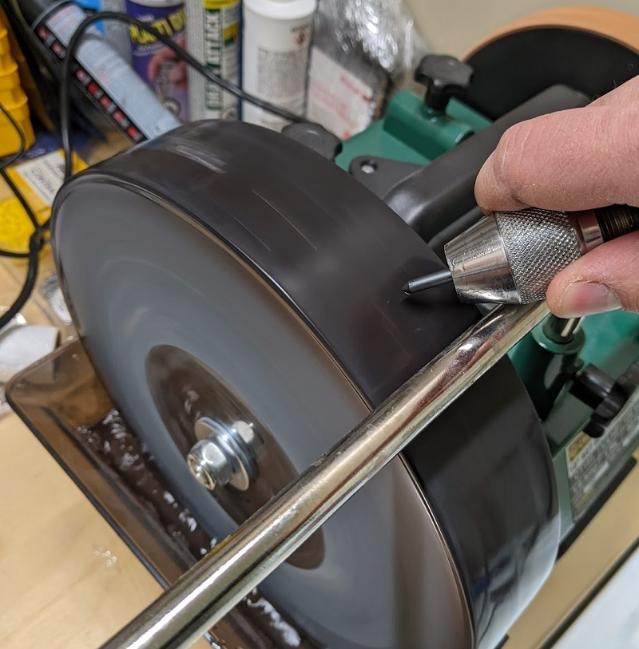
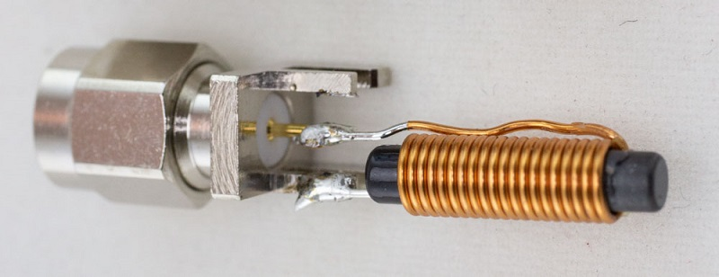
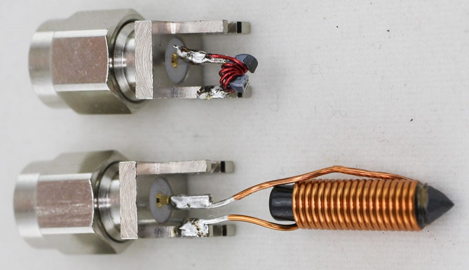
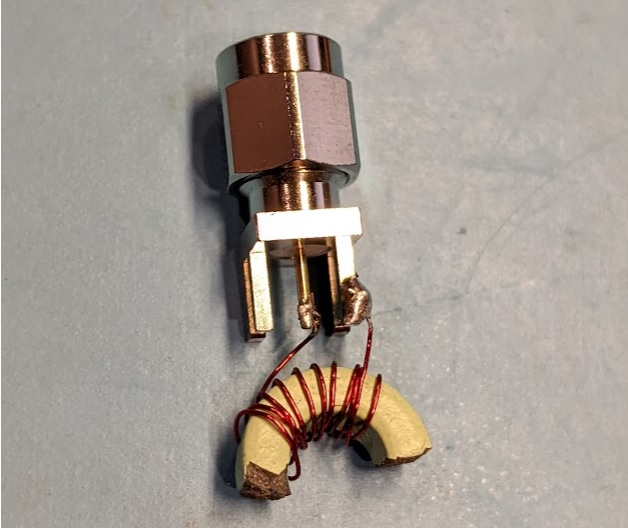

# Building Injection Tips

The injection tips are a key part of the usage
of your EMFi tool. This page includes some
examples and tips for when you go to build
your EM tip.

Typically the design of the tips is wire wrapped
around a ferrite core. The core helps
concentrate the magnetic field, but isn't
required to be present.

## Ferrite Cores

Ferrite cores can be purchased off the shelf
from electronics distributors. You can often
search for "rods" for example

### Shaping Ferrite Cores

Ferrite cores can be shaped with a wet grinding
wheel. These are typically used as knife
sharpeners. The following example one was
purchased from Busy Bee Tools in Canada 
(similar to Harbour Freight in US), part number
CT191:

This can be especially useful for shortening
cores. To do this:

1. Cut or break the core with pliers.
2. Use the wet wheel to flaten off the broken end.

## SMA Adapters

Various SMA connectors can be used to adapt to
the SMA connector. For example:

* CONSMA013.062 is used in several examples below. It's an edge-mount male connector.

## Various Examples

### Built Using Inductors

Ferrite-core inductors are common parts, and save you from winding your own coils.

#### Coil Craft

The following was built using `PCV-0-472-03L` inductor. This ferrite has a 'hollow core', but
still seems effective for F-I purposes:

#### Würth Elektronik

The following is a smaller inductor, Wurth `744710603` (available on Digi-Key):

You need to unwind a wrapping to connect to the SMA. I'd consider trying this coil with less windings
as well (unwrap more windings, but keep the windings as close to the 'active' end as possible).

### Shapping Ferrite Core

The following shows the Wurth `744710603` shaped, along with a small ferrite toroid (`35T0119-00P`):

The following is an example of doing something funky with a ferrite core:

Interestingly note that despite the excessive length of the ferrite, it *still* injects faults.
The strength is lower than with a more sane coil setup, but it shows that the ferrite couples
the energy well.

A simple toroid core can be cut in half easily, the following photo shows a roughly cut (with 
side cutters) core. This shows that even without a wet grinder you can still have fun! The
wire used is AWG30 magnet wire.

